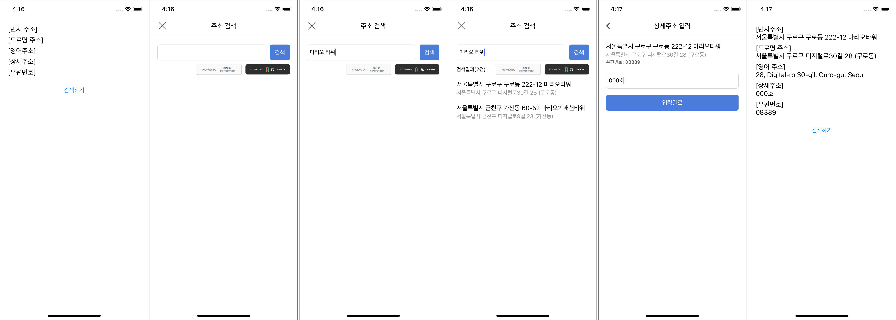
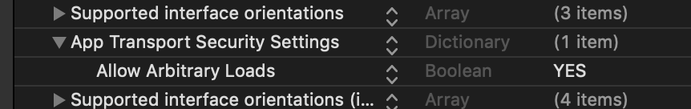
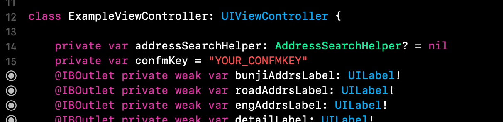
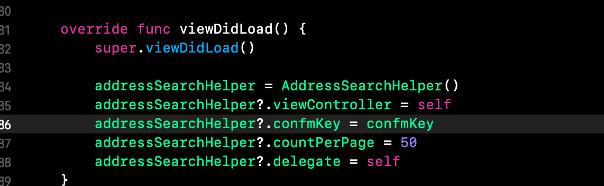
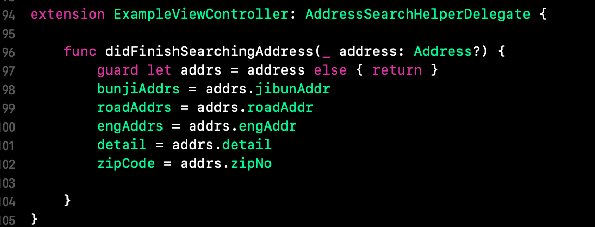
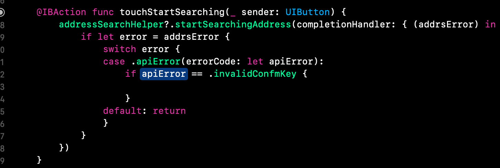
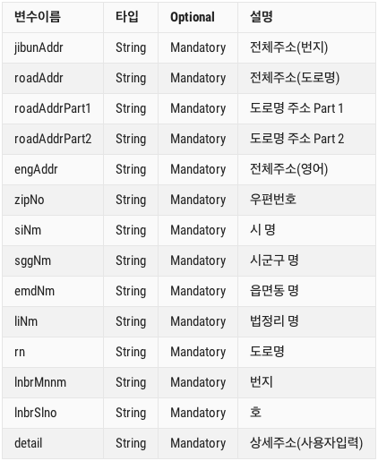

# 대한민국 주소 검색 Library - iOS
## 소개

- 웹뷰(WebView)가 아닌 iOS 네이티브(Native)를 사용해서 주소 검색을 할 수 있는 Library입니다. 
- 모바일 플랫폼 iOS와 Android를 각각 네이티브로 지원합니다.
- Android 깃헙 URL --> https://github.com/TLCompany/AddressSearch-Android 
- 주소 검색은 '한국지역 정보 개발원'에서 제공하는 API를 사용하였습니다. (https://www.juso.go.kr/addrlink/getDevEventBoardMainList.do)
- 이 Library는 TLSolution에서 제작하였습니다. (http://www.tlsolution.co.kr)
- 아래의 스크린샷을 참고해 주세요.

## 설치 방법
- CocoaPods를 사용해서 쉽게 설치해 주세요. 
`pod 'AddressSearchModule'`

## 사용 방법 
1. 프로젝트의 info.plist 파일에서 App Transport Security Settings을 추가해 주시고, 그 안에 Allow Arbitrary Loads의 값을 YES로 넣어주세요. 

2. 주소 검색을 시작할 ViewController에서 AddressSearchHelper의 객체를 만들어 주시고, 한국지역 정보 개발원에서 confmKey를 발급 받아 주세요. 그리고 viewDidLoad()에서 AddressSearchHelper의 세팅을 완료해 주세요.

3. delegate 패턴을 통해서 주소 데이터 콜백을 받을 AddressSearchHelperDelegate을 extension에 구현해 주세요.

4. 마지막으로 주소 검색을 시작을 startSearchingAddress()를 통해서 실행시켜 주세요.

## 데이터 모델
- Address 모델의 데이터

## 개발회사 소개 
- 우리는 스타트업의 성장을 위한 모바일 통합 개발 솔루션을 통해 성공적인 비즈니스를 만들어갑니다.
- TLSolution 홈페이지: http://www.tlsolution.co.kr/
